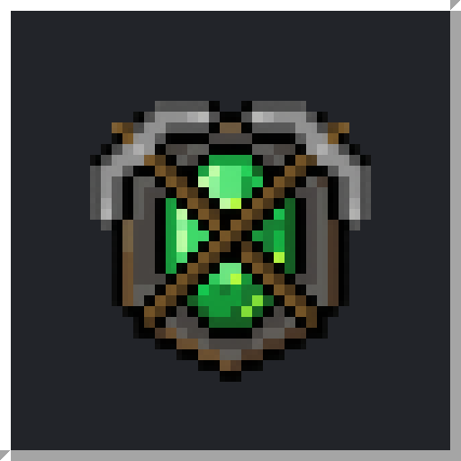

# Ars Fodina

A beautiful, offline-first Minecraft launcher for Windows 11 with CurseForge modpack browsing and one-click instances. Built with Electron + React + TypeScript.



## What it does

- **Play offline** — no Microsoft account required. Ars Fodina derives the same deterministic offline UUID vanilla uses (`UUID.nameUUIDFromBytes("OfflinePlayer:" + name)`), so your worlds and identity stay consistent across sessions.
- **Real vanilla installs** — fetches the live Mojang version manifest, downloads the client jar, OS-ruled libraries, assets, and extracts natives, all hash-verified with a concurrent download pool.
- **Every loader, one click** — Fabric (from Fabric's meta service) and **Forge / NeoForge** (by running their official installer headlessly, so the patch processors run exactly like the vanilla launcher does).
- **CurseForge modpacks** — search, browse, and install modpacks. Downloads the pack, installs the required loader, resolves every mod, and applies overrides into an isolated instance.
- **Per-instance everything** — each instance has its own mods, worlds, configs, RAM override, and game folder.
- **Java auto-detection** — finds JDKs on `PATH`, `JAVA_HOME`, and common Windows install dirs, then picks the right major version for each Minecraft build.
- **Live launch console** — streamed stdout/stderr with a progress dock for installs and launches.

## Design

"Ars Fodina" (Latin: *the art of the mine*) — every surface is a block face with a hard Minecraft-GUI bevel: square corners, flat colour, no gradients anywhere. Pixelify Sans display over Inter body, both bundled so the app needs no network for fonts. Six biome themes (Overworld, Nether, The End, Deep Dark, Snowy, Daylight) each swap an ore-vein accent and a pixel-art banner plate; the sprites are generated pixel art rendered at their true resolution with `image-rendering: pixelated`.

## Requirements

- **Windows 11** (also runs on macOS/Linux for development)
- **Node.js 20+** and **npm** (to build)
- **Java** to actually launch the game — JDK 17 or 21 covers most modpacks; the newest Minecraft builds may want Java 25. Adoptium/Temurin recommended.

## Getting started

```bash
npm install        # installs deps + the Electron binary
npm run dev        # hot-reloading dev app
```

## Building the Windows app

```bash
npm run dist            # NSIS installer + portable .exe (x64)  -> release/<version>/
npm run dist:portable   # portable .exe only
```

Artifacts land in `release/<version>/`. The NSIS installer lets the user choose the install directory and creates Start-menu/desktop shortcuts.

### One-click Windows build

Install **Node.js 20 LTS or newer** from <https://nodejs.org>, download or clone this project, then double-click `build-windows.cmd`. The helper installs the exact locked dependencies, type-checks the project, and builds both the installer and portable executable.

You do not need Visual Studio or a JDK to package the launcher. Java 17/21/25 is only needed when using the finished launcher to install loaders and run Minecraft.

> Run `npm run dist` **on Windows** (or a Windows CI runner) to produce signed-ready `.exe` output. electron-builder cross-building for Windows from Linux/macOS works for unsigned builds but Windows is the reliable path.

## CurseForge setup

Ars Fodina never ships an API key inside the desktop app. Two ways to connect (Settings → CurseForge):

1. **Proxy (recommended)** — point Ars Fodina at a [ServerCraft](../servercraft)-style server that holds the key server-side. Default: `http://localhost:3847`. Ars Fodina calls `/api/cf/search`, `/api/cf/packs/:id`, and `/api/cf/packs/:id/files`.
2. **Direct key (fallback)** — paste a free key from <https://console.curseforge.com>. Used only when no proxy URL is set. Direct mode also unlocks efficient per-file resolution for large packs.

## Architecture

```
src/
  main/                    Electron main process (Node) — all privileged work
    index.ts               window + lifecycle
    ipc.ts                 IPC orchestration, running-game registry
    core/
      paths.ts             filesystem layout
      store.ts             JSON persistence (settings / instances / account)
      auth.ts              offline UUID
      http.ts              hash-verified downloads + concurrency pool
      manifest.ts          Mojang version manifest + version JSON types
      rules.ts             OS/allow-disallow rules, native classifiers, maven paths
      installer.ts         resolve + install (client, libs, assets, natives)
      fabric.ts            Fabric loader install
      forge.ts             Forge / NeoForge headless install + version listing
      launcher.ts          JVM command-line build + spawn
      java.ts              Java discovery + version selection
      curseforge.ts        CF client (proxy or direct) + forgecdn URLs
      cfinstall.ts         client-side modpack install (manifest → mods → overrides)
  preload/index.ts         contextBridge — exposes window.arsFodina
  shared/                  types + IPC contract shared by main & renderer
  renderer/                React UI (Vite)
    src/
      App.tsx              shell + routing
      store/store.ts       Zustand store wired to main-process event streams
      pages/               Library, Discover, Settings, modals, instance drawer
      components/          title bar, rail, dock, console, world bg, logo, avatar
      styles/global.css    the design system
```

The renderer is fully sandboxed from the OS: it never touches the filesystem or network directly — every action funnels through the preload bridge into the main process.

## Verified

`scripts/smoke.ts` exercises the real core against live services (Mojang manifest, the CurseForge proxy, the forgecdn CDN) plus the pure algorithms:

```bash
npx esbuild scripts/smoke.ts --bundle --platform=node --format=esm --outfile=/tmp/smoke.mjs && node /tmp/smoke.mjs
```

## Prebuilt portable (Windows x64)

`release/1.0.0/Ars Fodina-1.0.0-win-x64-portable.zip` is a ready-to-run portable build (unzip → run `Ars Fodina.exe`). It's cross-built on Linux, so it's **unsigned** (Windows SmartScreen will ask once → "More info" → "Run anyway") and the `.exe`'s Explorer icon is Electron's default. Running `npm run dist` **on Windows** produces the signed-ready NSIS installer with the proper icon.

## Known limitations

- **Forge / NeoForge** now install and launch via the official installer. That installer downloads loader libraries and runs patch processors, so it needs network and a Java that matches the Minecraft version (Ars Fodina auto-selects it; make sure the right JDK is installed). Very old Minecraft versions on a very new JDK can trip the processors — install the matching JDK if a loader install fails.
- A small number of CurseForge mods opt out of third-party API distribution; those are reported as skipped and can be added manually to the instance's `mods/` folder. Large packs resolve fastest in direct-key mode.
- Multiplayer on `online-mode=true` servers still requires a genuine Microsoft/Mojang account — offline mode is for singleplayer and offline-mode servers.

## License

MIT
