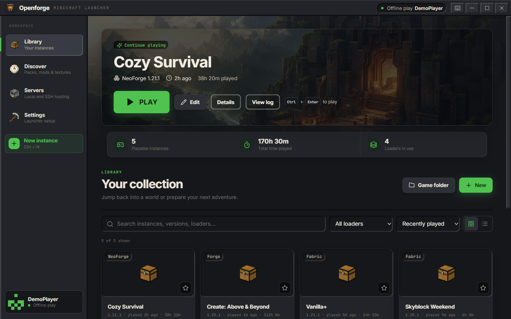
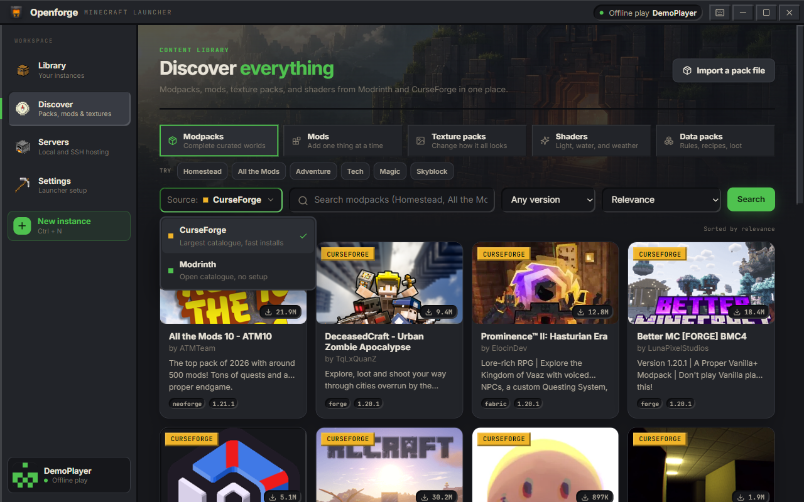
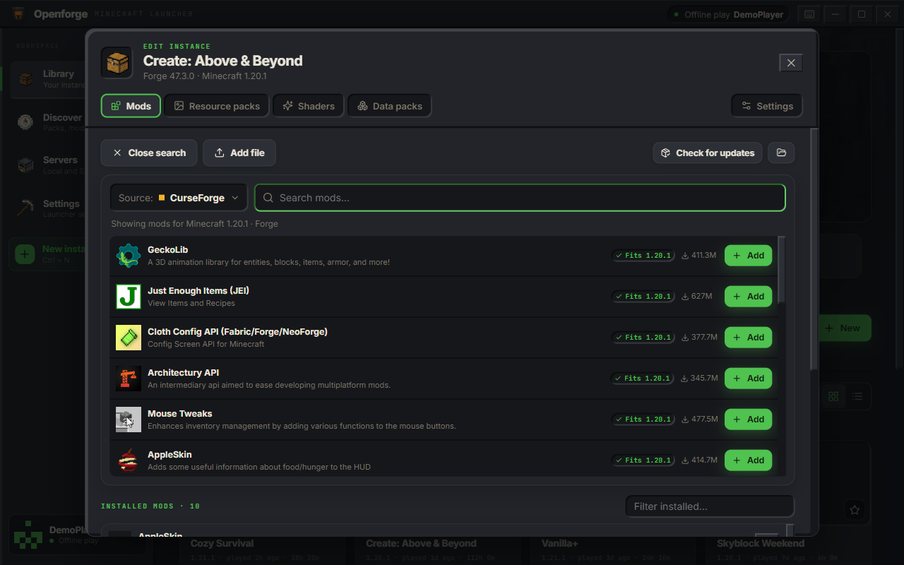
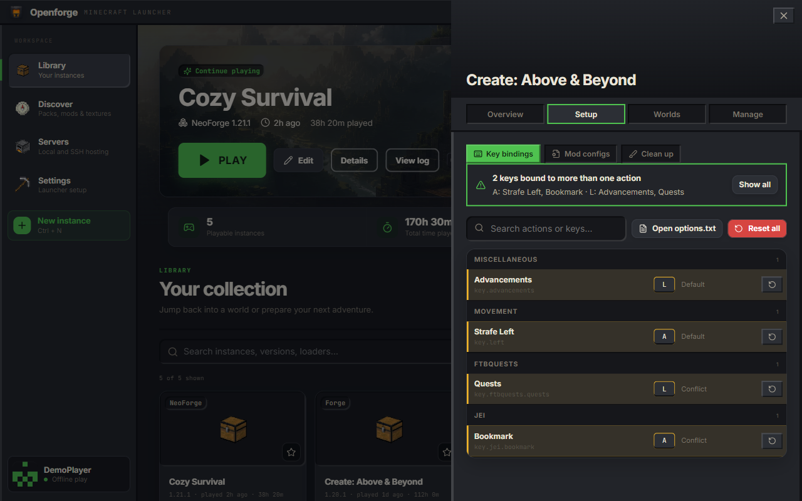
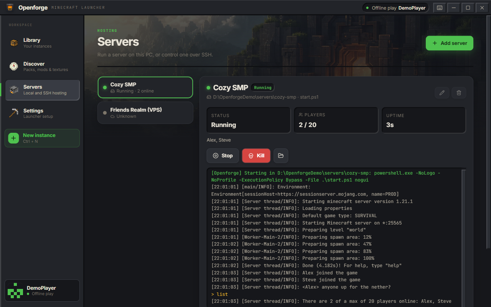
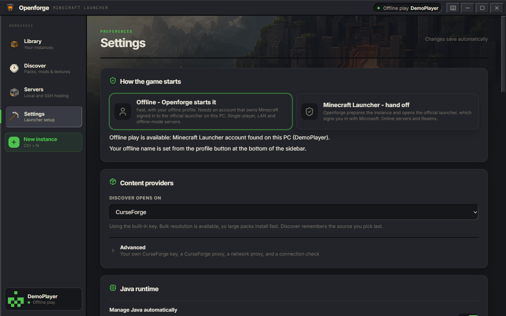

# Openforge

A Minecraft: Java Edition launcher for Windows that installs modpacks, mods, texture packs and shaders
from CurseForge and Modrinth, and keeps each setup in its own instance.

**[Download the latest release](https://github.com/aquinas22/openforge/releases/latest)** (Windows,
64-bit)



Openforge is a hobby project by one person. It works well for the things listed below, and the
limits are listed too. It is not affiliated with, endorsed by, or connected to Mojang Studios or
Microsoft. "Minecraft" is a trademark of Mojang Studios.

## Features

### Find packs and mods

Browse CurseForge and Modrinth from one page and switch between them with the source picker. Filter
by Minecraft version, sort by popularity or recent updates, and install a whole modpack with one
click. Texture packs, shaders and data packs install the same way, into the right folder.



- Release builds include a CurseForge API key, so CurseForge works without any setup. Modrinth needs
  no key at all.
- `.mrpack` and CurseForge pack zips can be imported, and any instance can be exported in either
  format.
- Updating a pack replaces the pack's own mods and configs but never touches your worlds,
  screenshots or backups, and keeps mods you added yourself.

### Edit an instance

The **Edit** button opens an instance's mods, resource packs, shaders, data packs and settings. Press
**+ Add** to search CurseForge or Modrinth right there, already filtered to the instance's Minecraft
version and loader. Required dependencies come along automatically. You can also turn mods on and
off, update or remove them, or drop `.jar` and `.zip` files onto the list.



Changing an instance's Minecraft version or loader first checks every mod against the new target and
tells you which ones have a matching build before anything changes.

### Fix key conflicts and tidy up

Each instance has a **Setup** tab:

- **Key bindings** reads the instance's `options.txt`, lists every binding (vanilla and modded) and
  flags keys that are bound to more than one action. You can reset one binding or all of them.
- **Mod configs** lists the files in `config/` and points out ones that no installed mod seems to
  own.
- **Clean up** finds old logs, crash reports and caches, shows how much space they use, and moves
  what you pick to the Recycle Bin.



### Run servers

See [Servers](#servers) below.



### Settings that stay out of the way

Settings save as you change them. Openforge downloads the right Java for each Minecraft version
(Eclipse Temurin 8, 17, 21 or 25) and reuses runtimes the official launcher already installed, so you
don't need to install Java yourself. Six colour themes are included, one of them light.



### Under the hood

- Loaders: Fabric, Quilt, Forge and NeoForge. Forge and NeoForge are installed by running their
  official installers.
- Every download is checked against its published hash before it is used, so an interrupted download
  can't leave a broken file behind.
- Once an instance has been verified, later launches skip re-checking every file, which makes a
  second launch much faster than the first.
- All network traffic goes through Chromium's network stack, so your system proxy and certificate
  store apply.

## Install

Download one of these from the [releases page](https://github.com/aquinas22/openforge/releases/latest):

| File | What it is |
| --- | --- |
| `Openforge-<version>-x64.exe` | The installer. Adds Start menu and desktop shortcuts and an uninstaller. You can pick the install folder. No admin rights needed for a per-user install. |
| `Openforge-<version>-portable.exe` | A single exe that runs without installing. Handy for trying Openforge out or keeping it on a USB drive. |

Both keep their data (settings, instances, worlds) in `%APPDATA%\Openforge`, so you can switch
between them. Uninstalling does not delete that folder.

### "Windows protected your PC"

The exe files are not code-signed yet (a signing certificate costs money this project doesn't have),
so Windows SmartScreen will likely warn you the first time you run one. To continue, click
**More info**, then **Run anyway**.

If you would rather not trust a prebuilt exe, you can [build it yourself](#building-from-source).

## How to play

Openforge does not have Microsoft sign-in right now, so there are two ways to start the game.

**1. Offline play from Openforge.** Openforge starts the game itself with an offline profile (a name
you choose). This only works on a PC where the **official Minecraft Launcher is installed and signed
in** with an account that owns Minecraft: Java Edition. Openforge checks that such an account exists
in the launcher's files; it reads nothing else from them and never sees your password or tokens. If
no account is found, Play stays locked and Openforge explains how to fix it.

Offline play covers single-player, LAN, and servers that run with `online-mode=false`. Servers that
check accounts (most public servers) and Realms will refuse an offline profile.

**2. Hand off to the official Minecraft Launcher.** Openforge prepares the instance, adds it as a
profile in the official launcher, and opens it. The official launcher signs you in, so online
servers and Realms work normally. Choose **Minecraft Launcher - hand off** in Settings to make Play
always do this, or use **Open Minecraft Launcher** from the profile panel (bottom of the sidebar).

## Servers

The **Servers** page manages servers you run yourself.

- **Local:** point Openforge at a server folder (a server `.jar`, or a `run.bat` / `start.ps1` like
  Forge and NeoForge servers use), or create a fresh vanilla server. Start and stop it, type into its
  console, and see players online and uptime. Stop sends `stop` and waits before killing the process,
  and quitting Openforge stops running servers the same way.
- **Over SSH:** control a server on another machine through tmux, screen or systemd, send console
  commands and stream its log. SSH needs **key authentication** (a key file or ssh-agent); Openforge
  never asks for or stores a password. It uses the OpenSSH client built into Windows.

## FAQ

**Is it free? Do I still need to buy Minecraft?**
Openforge is free and open source. You still need to own Minecraft: Java Edition; offline play only
unlocks on a PC where the official launcher is signed in with an account that owns it.

**Why no Microsoft sign-in?**
New apps need Mojang's approval before they can use the Minecraft login services, and Openforge
doesn't have that yet. The sign-in code exists but is switched off. See the roadmap below.

**Where are my files?**
Everything is under `%APPDATA%\Openforge`. The game files and instances are in its `minecraft`
folder, which you can move in Settings. The **Game folder** button in the Library opens it.

**Does it work on macOS or Linux?**
The release is Windows only. The app runs on other platforms for development, but that is not
tested or supported.

**CurseForge or Modrinth search fails on my school or work network.**
Some networks inspect HTTPS traffic, which breaks the connection to Mojang, CurseForge and Modrinth.
Settings -> Content providers -> Advanced has a connection check that says when this is happening.
Openforge never turns off certificate checks to get around it; install your organisation's root
certificate or use another network.

**A modpack says some files have to be downloaded by hand.**
A few CurseForge authors don't allow other launchers to download their files. Openforge lists those
with direct links so you can fetch them yourself.

**Does Openforge collect data?**
No. There is no telemetry. It talks to Mojang, CurseForge, Modrinth, the loader sites and Adoptium to
download what you ask for.

## Building from source

You need [Node.js](https://nodejs.org) 20 or newer and npm. No JDK or Visual Studio is required.

```bash
npm ci            # install the locked dependencies
npm run dev       # run the app with hot reload
npm run check     # type-check and run the verification suite
npm run dist      # build the installer and portable exe into release/<version>/
```

On Windows you can also double-click `build-windows.cmd`, which runs the install, check and build
steps for you.

### CurseForge access

Modrinth works in every build. CurseForge needs an API key, and there are three ways to provide one:

1. **Built in at build time.** Set `OPENFORGE_CF_KEY` before `npm run build` or `npm run dist`. The
   key is lightly obfuscated in the main-process bundle (not encrypted; anyone with the app can
   recover it) and is never sent to the renderer. Without the variable the build simply has no
   built-in key, and Discover uses Modrinth.
2. **Your own key.** Paste a free key from <https://console.curseforge.com> in Settings -> Content
   providers -> Advanced.
3. **A proxy.** Point Openforge at a server that holds the key and forwards `/api/cf/search`,
   `/api/cf/packs/:id` and `/api/cf/packs/:id/files`.

If more than one is set, the proxy wins, then your own key, then the built-in key.

### Screenshots

`scripts/screenshots.mjs` regenerates the images in `docs/screenshots/`. It seeds a throwaway data
folder with demo instances, a demo server and a stand-in launcher account, starts the built app
against it, and drives it over the Chrome DevTools Protocol. It never reads your real Openforge data
or `.minecraft` folder.

```bash
npm run build
node scripts/screenshots.mjs
```

### Project layout

```
src/
  main/        Electron main process: installs, launches, downloads, servers, IPC
    core/      the launcher engine (Mojang manifests, loaders, CurseForge, Modrinth, Java, ...)
  preload/     the bridge that exposes a small API to the UI
  renderer/    the React UI
  shared/      types and settings shared by both sides
scripts/
  verify.ts    runs the real core modules against a local fake CDN and proxy
```

The UI never touches the file system or network directly; every action goes through the preload
bridge to the main process.

## Roadmap

- Microsoft sign-in inside Openforge, once an app registration is approved by Mojang. The plan is in
  [docs/microsoft-auth-plan.md](docs/microsoft-auth-plan.md).
- A code-signed release, so SmartScreen stops warning.

## License

[MIT](LICENSE). Copyright (c) 2026 Noah Roe.

Openforge is not an official Minecraft product and is not approved by or associated with Mojang
Studios or Microsoft.
